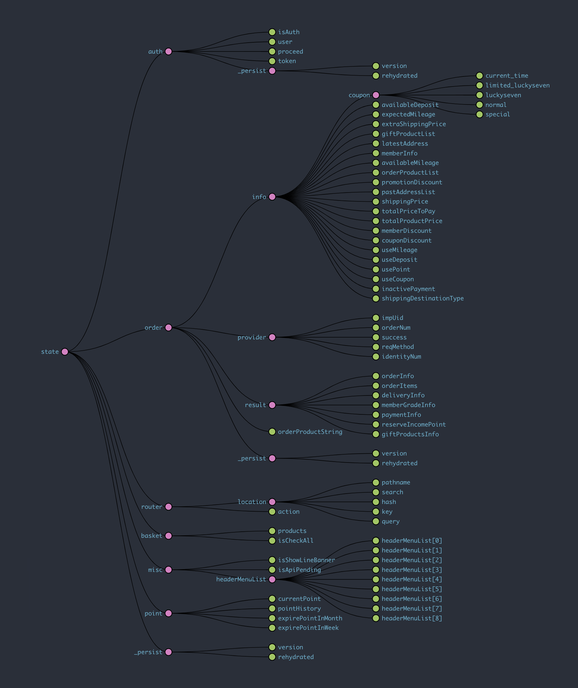
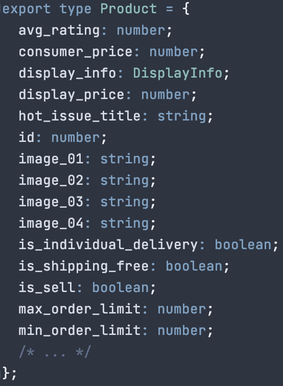

# Why should we use GraphQL?

---

말로만 도입하자고 하기엔 논리가 부족해서

---

말로만 도입하자고 하기엔 논리가 부족해서
__정말로 GraphQL이 우리의 문제를 해결해줄 수 있는지 궁금해서__

---

백번 양보해서 GraphQL 좋다고 하자.
우리가 지금 어떤 어려움, 문제를 갖고 있는지 알아야 하지 않을까?

---

# 상태 관리의 어려움

---

---

## UI의 상태가 아닌 서버의 상태

---

# 스키마 관리의 어려움

---

## Do you know...?

- Product
- TogetherProduct
- EnhancedProduct
- QuickAddProduct
- OptionWithProduct
- OrderProduct
- ProductInOrderForm
- ProductInBasket

사용하는 View(페이지, 화면)마다 조금씩 다른 Product 관련 스키마들

---

# 타입 관리의 어려움

---

뉴욕타임즈 선정, 타입스크립트 쓰면서 가장 짜증나는 부분 1위

### 인터페이스 정의하기 🏆

---

# 컴포넌트 관리의 어려움

---

### 주로 이런 것들이 어렵습니다:

- 적절한 타이밍에 데이터 가져오기 & 전달하기
- 가져온 데이터의 안정성 - _정말 페칭이 끝났을까?_
- 로딩 상태 표시하기

---

## GraphQL이 해결할 수 있을까?

---

정확히 하자면 GraphQL는 쿼리 언어일 뿐,
GraphQL 클라이언트가 해결할 수 있을까?

_예) Apollo Client, Relay, Urql..._

---

## GraphQL 클라이언트가 해결할 수 있을까?

- __상태 관리의 어려움__
  - GraphQL 클라이언트의 캐시 레이어 활용

---

## GraphQL 클라이언트가 해결할 수 있을까?

- __스키마 관리의 어려움__:
  - 서버에서 도메인 간의 관계를 스키마를 통해 정리
  - 클라이언트에서는 필요한 데이터만 선언해서 요청

---

## GraphQL 클라이언트가 해결할 수 있을까?

- __타입 관리의 어려움__: 
  - GraphQL Code Generator를 사용하여 인터페이스 자동 생성
  - Query 응답 결과도 자동으로 생성

---

## GraphQL 클라이언트가 해결할 수 있을까?

- __컴포넌트 관리의 어려움__:
  - 선언적인 데이터 페칭
  - Suspense 를 사용하여 데이터 페칭이 완료되었음을 보장
  - Fallback UI 제공

---

# 해결 할 수 있다
고 생각합니다

---

### Roadmap

- GraphQL 쿼리 서버 작성
- 첫 단추는 홈 큐레이션 개편
- 연내 순차적으로 적용

---

# end of slides.