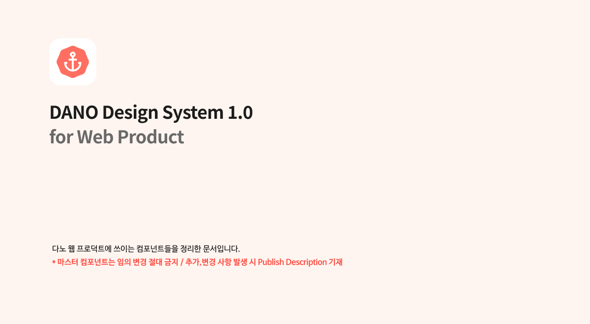
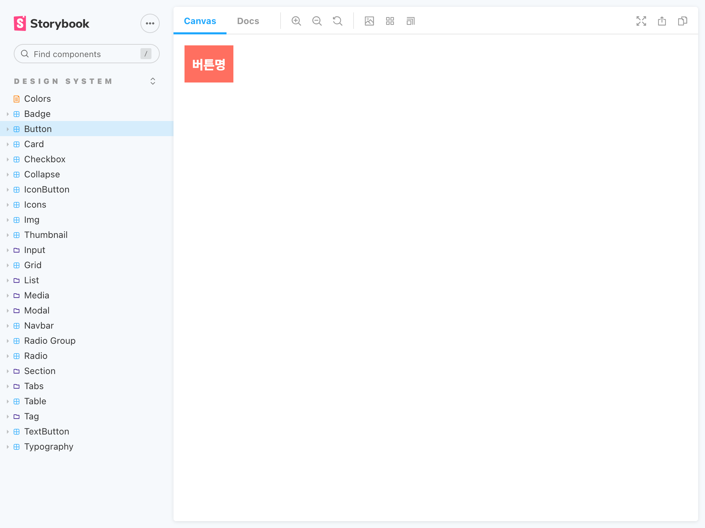

# 프론트엔드 팀 2020년 회고 및 2021년 계획

---

# 2020년 회고

---

<!--
작년 한 해 동안 다양한걸 했는데 먼저 안정성과 관련된 것들을 돌아보자면
-->

## Stablity

---

<!--
타입스크립트를 사용하기 시작했다는 점
-->

---

<!--
프론트엔드에도 테스트 코드가 쓰여지기 시작을 했다는 점.
-->

---

<!--
못챙긴 부분도 있었어요. 대표적으로 에러 핸들링과 퍼포먼스인데요

에러 핸들링의 경우 프론트에서 작성하는 코드 예외 처리라던지, 아니면 서버 API 예외 처리라던지 이런 부분을 많이 챙기지 못했던 것 같아요.

퍼포먼스, 성능은 이제 여러 지표를 의미하기도 하는데 그런 것보다 중요한건 작년 한 해동안 신경을 크게 쓰지 못했다는 점. 내년에는 이런 부분들을 챙길 수 있도록 노력해보고 싶습니다.
-->

Error Handling, Performance (Web Vitals)

---

<!--
디자인 시스템도 진행을 했습니다. 아직 진행중이긴 한데요. 작년에 했던 일 중 빼먹을 수가 없다고 생각합니다.

시스템을 통해서 일관성 있는 디자인을 제공하면 사용자도 편리하고 만드는 입장에서도 편리하니까 꼭 해야 한다고 생각했기 때문에 개인적으로 반가운 작업이었고 즐겁게 개발을 했던 것 같습니다.
-->

## Design System

---

<!--
했다는 것 자체만으로도 중요하지만, 디자이너분들과 디자인 시스템 슬랙 채널에서 커뮤니케이션을 하고 피그마로 코멘트 주고 받으면서 피드백을 빠른 주기로 받았던게 기억이 납니다.
-->

---

<!--
그러면서 도입하게 된 툴이 이 스토리북이라는 툴입니다.
-->

---

<!--
스토리북은 프론트엔드에서 작성한 코드를 이렇게 컬렉션을 만들고 확인해볼 수 있는 툴인데요 디자인 시스템을 구현하면서 어떤 방식으로든 코드로 구현된 것을 디자이너분들에게 피드백을 받아야 했는데, 스토리북이 정말 적절했습니다.
-->

---

<!--
팀 얘기를 하자면, 작년 턴어라운드 전략으로 다노샵에 리소스가 집중되게 되었고 저도 그 영향으로 마이다노 웹을 보다가 다노샵을 보게 되었는데 이게 가장 큰 터닝 포인트가 되었던 것 같아요

그 전에도 똑같이 스탠드업도 하고 PMI도 하고 했는데, 같은 코드를 보면서 하는 것과 그렇지 않은 것에는 엄청 큰 차이가 있구나 를 알게 되었습니다.

그것 말고도 말할 것은 많지만 그냥 다 축약해서 한마디로 정리하자면
-->

## Team

---

<!--
같이 일하는 것의 가치, 소중함을 일깨우게 되지 않았나 싶습니다
-->

같이 일하는 것의 가치

---

<!--
2020년 팀 회고는 요정도로 마무리하고, 올해 목표를 공유드리자면
-->

# 2021년 목표

---

<!--
얕은 지식을 넓게 퍼트리려고 합니다. 작년에 개발본부 내에서 세미나를 몇번 진행됐었는데
저도 준비해본 경험을 바탕으로 힘든점을 꼽아본다면 당연히 발표 자료를 준비하는 것인데요

오디언스가 개발본부 전체 대상이었기 때문에 이를 고려해서 주제를 잡아야 하고, 발표 내용도 많이 다듬고 고민을 해야 했습니다.

대신에 팀 내에서 세미나나 스터디를 하게 되면 그런 자리를 준비하는 허들이 많이 낮아질거라는 기대가 있습니다.

개인적으로는 이게 각 팀에서 활성화가 되어서 언젠가 다노 데브톡, 테크콘 같은 것도 할 수 있지 않을까 하는 기대가 있습니다.
-->

## 얕은 지식 넓게 퍼트리기

"작은 세미나 & 스터디" 활성화 하기

---

<!--
기술적으로 더 나아가는 것도 목표중에 하나입니다. 그냥 좋아보이는 기술을 택하는 것이 아니라
프로덕트와 비즈니스를 위해 나아가는게 목표입니다.
-->

## 기술적으로 나아가기

개발자의 니즈가 아닌, 프로덕트와 비즈니스를 위해 위해 한 걸음 더 나아가기
_(리팩토링, 원디자인, GraphQL, SSR)_

---

<!--
희망사항 중에 하나는 프론트 팀이 더 많은 인원으로 늘어나면 좋겠습니다.
그래서 인원이 늘어났을 때 생산성이 반대로 떨어지지 않기 위한 환경을 계속해서 만들어 나가고자 합니다.
-->

## 인원이 늘어나도 생산성이 떨어지지 않는 환경 만들기

폴더 구조(아키텍쳐) 정리 & 개선, 문서화, QA 프로세스 도입 등

---

끝